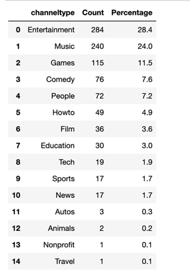
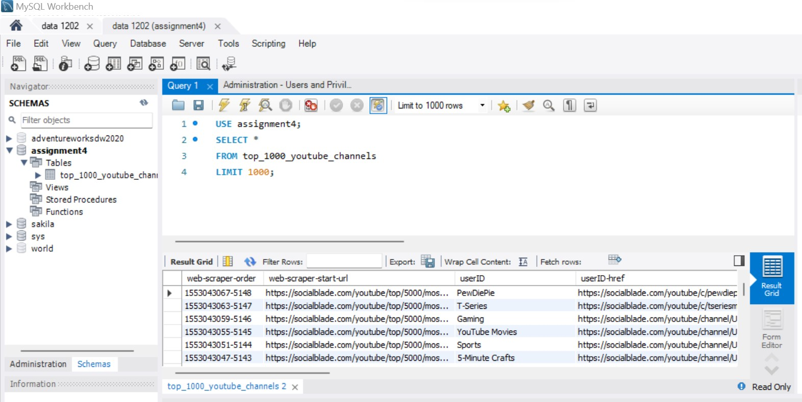

# DATA-ANALYSIS-TOOLS-ANALYTICS 
One Paragraph of project description goes here....

## Getting Started
Follow these instructions to get a copy of the project up and running on your local machine for development and testing purposes.

## Prerequisites
Python
pandas
sqlalchemy
pymysql (for MySQL connection

## Installing
Install the required packages
```
pip install sqlalchemy
pip install pymysql

```
## Usage
### Import Python Libraries
```
import pandas as pd
from sqlalchemy import create_engine
import pymysql
```
### Read CSV File

```
df = pd.read_csv("ramid\Documents\Durham\youtube_dataset.csv", encoding='latin-1')
```

### Functionality
### Calculate Channel Type Distribution

The code includes a function channeltype(data) to calculate the distribution of channel types from the top 1000 records of the dataset. The function returns a DataFrame with the 'channeltype', 'Count', and 'Percentage' columns.
```
def channeltype(data):
    top_1000 = data.iloc[0:1000]
    distribution = top_1000['channeltype'].value_counts( )
    percentage= distribution / len(top_1000) * 100
    result_table = pd.DataFrame({
        'channeltype': distribution.index,
        'Count': distribution.values,
        'Percentage': percentage.values
    })
    return result_table

```
### Save Top 1000 Records
The code extracts and saves the top 1000 records into a separate CSV file named top_1000_channels.csv.
```
top_1000 = df.iloc[0:1000]
top_1000.to_csv("top_1000_channels.csv", index=False)

```

### Save Top 1000 Records to Database Table
An engine is created using SQLAlchemy to establish a connection to a MySQL database. Subsequently, the to_sql method is utilized to passively save the DataFrame (top_1000) into a table named 'top_1000_youtube_channels' within the designated database. This operation is conducted in a manner that replaces the existing table if it already exists. 

```
# Create the engine with the MySQL dialect and the appropriate connection details
# Create the engine
engine = create_engine(f'mysql+pymysql://{username}:{password}@{host}/{database_name}')
#saveing the top_1000 to database with name top_1000_youtbue_channels
top_1000.to_sql('top_1000_youtube_channels', con=engine, if_exists='replace', index=False)

```
## Deployment
The data frame created by function channel type.
```
dis = channeltype(df)
```


The loaded csv file "top_1000" in the SQL database "assignment4" named "top_1000_youtube_channels".


## Authors
Rami Dhungana K C  ([@ramidkc](https://github.com/ramidkc))

## Acknowledgments
This project is the result of the collaborative effort of the following contributors:

- Prof. Omar Altrad
- Jill Shah
- Nitesh Talukdar
- Uzma Khan ([@UzmaGitHub](https://github.com/UzmaGithub))

## License
This project is licensed under the MIT License - see the LICENSE.md file for details

